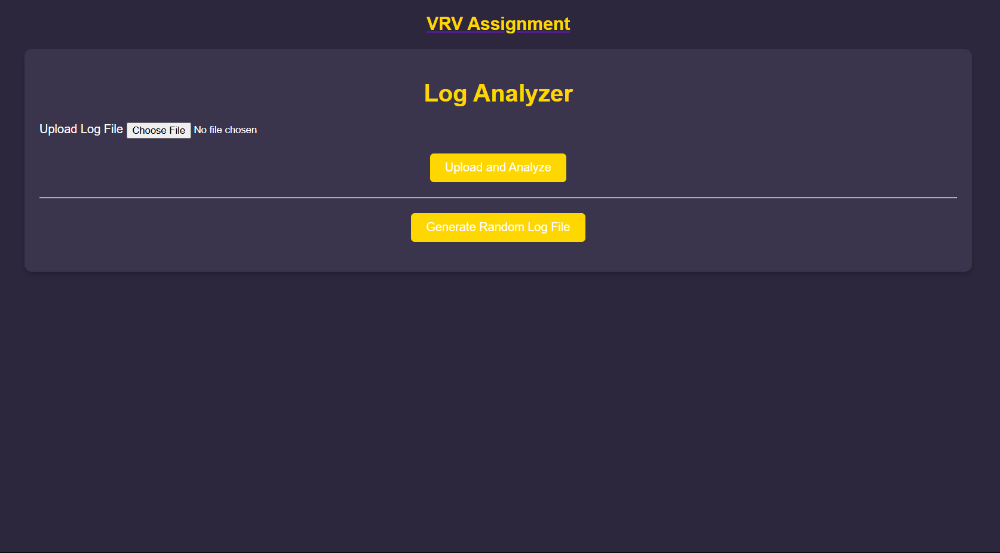
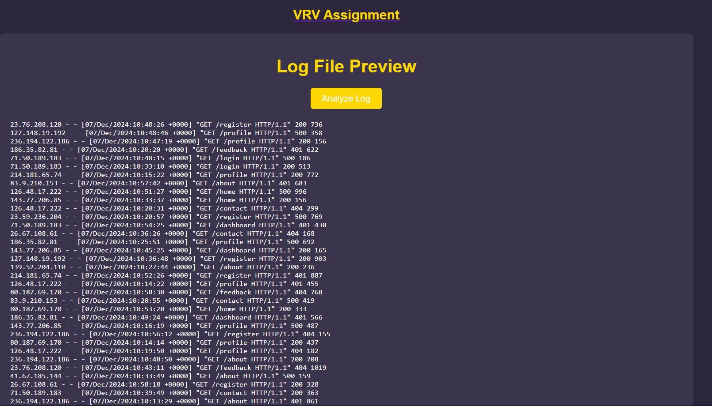
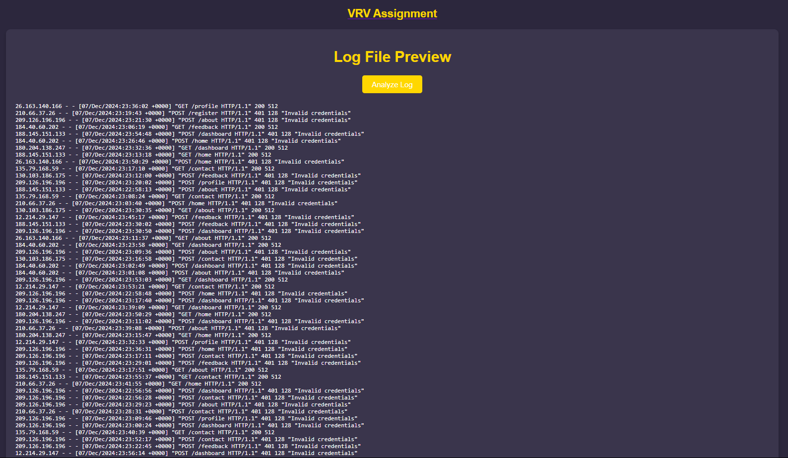
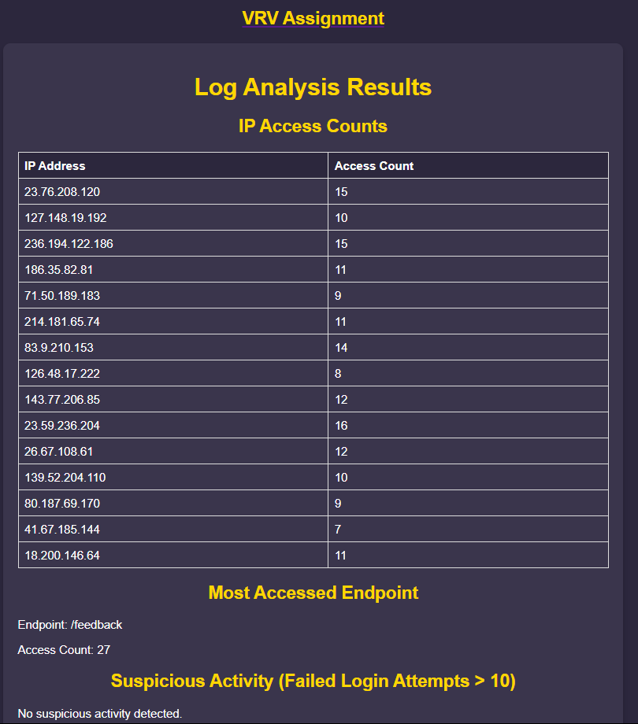
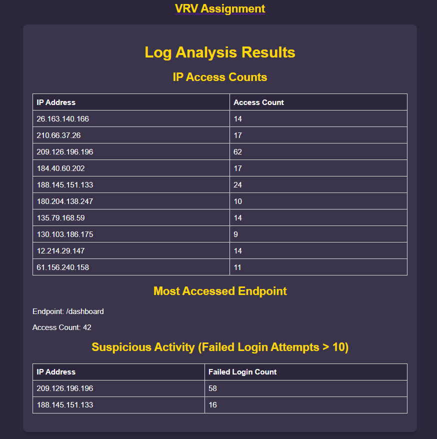
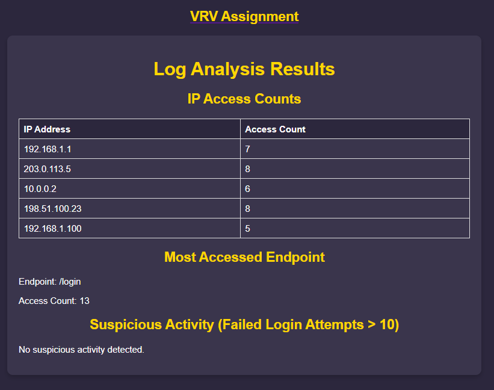

---

# Log Analysis Web App

## Overview

A Flask-based application to generate and analyze web server log files, providing insights into traffic, endpoints, and suspicious activities.

### Features
- **Log Generation**: Create random logs with unique IPs, endpoints, and status codes.
- **Analysis**:
  - Requests per IP.
  - Most accessed endpoint.
  - Detect failed login attempts.
- **Interface**: Upload, preview, and analyze logs.
- **CSV Export**: Download results as a CSV.

---

## Structure

- **`app.py`**: Routes, log generation, and analysis integration.
- **`log_analysis.py`**: Processes logs and generates results:
  - Requests/IP.
  - Accessed endpoints.
  - Suspicious activity.
- **HTML Files**: 
  - **`index.html`**: Upload/Generate logs.
  - **`preview.html`**: View logs before analysis.
  - **`results.html`**: Analysis results.
- **`style.css`**: Custom styling.

---

## Setup

1. Clone the repository:
   ```bash
   git clone https://github.com/yourusername/log-analysis-web-app.git
   cd log-analysis-web-app
   ```

2. (Optional) Create a virtual environment:
   ```bash
   python3 -m venv env
   source env/bin/activate  # Windows: `env\Scripts\activate`
   ```

3. Install dependencies:
   ```bash
   pip install flask
   ```

4. Run the app:
   ```bash
   python app.py
   ```

Access at [http://127.0.0.1:5000/](http://127.0.0.1:5000/).

---

### Example Log Format
```plaintext
<IP> - - [<Date>] "GET /<Endpoint> HTTP/1.1" <Status Code> "<Message>"
```

### Example:
```plaintext
192.168.1.1 - - [08/Dec/2024:12:34:56 +0000] "GET /login HTTP/1.1" 401 "Invalid credentials"
```

---

### Output Highlights
- **Requests/IP**: Frequency of requests per IP.
- **Popular Endpoint**: Most accessed endpoint.
- **Suspicious Activity**: IPs with over 10 failed login attempts.

---

**Below are images of the web interface:**


<p align="center">
  
  
</p>
<p align="center">
  
  
</p>

### Answer to the sample log

